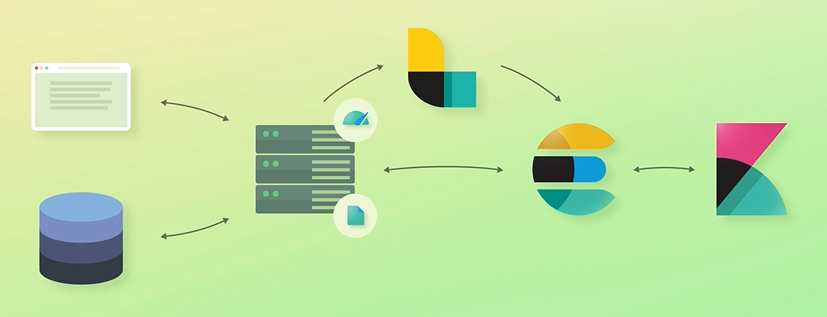

# Elasticsearch Overview
`Elasticsearch is an open source analytics and full-text search engine
It's often used for enabling search functionality for applications.`

**Examples:**
<br>
1: You can build complex search functionality with Elasticsearch, similar to what you see on Google.
(google search)
<br>
2: Relevance of highly rated products (Ví dụ như tìm 1 sản phẩm trên Shopee,
<br>
ngoài việc trả về các sản phẩm trong ngành hàng đó, website còn hiển thị các mặt hàng liên quan ở bên cạnh)
<br>
3: Elasticsearch is great at analyzing lots of data
<br>

## Elastic Stack Overview
Kibana:
<br>
Logstack:
<br>
X-Pack: Add additional features to the Elasticsearch & Kibana
- Security: Add authentication and authorization
- Monitoring: Gain insight into how the Elastic Stack is running
- Alerting
- Reporting: Export Kibana visualizations and data
- Machine learning
Graph: E.g. show related products or suggest songs

## Common Architecture
- Data is stored in a relational database
- Databases are not so great at full-text searches
- Elasticsearch is much better at this

- The application communicates with Elasticsearch
- Can be done with any HTTP library
- Using the official client libraries is recommended
  (if using Elasticsearch SQL, the officical JDBC driver can be used)

**How does the data get into Elasticsearch**
- The web application should keep data updated
- Data will be stored both in the DB and Elasticsearch
- What if we already have 100000 products, for example?
=> You will need to write a script that imports data
  (or find a tool that does this - the activity of these tools varies)
From there, the web application will keep data up to date
- This simple architecture is often the first step of integrating Elasticsearch
- Now we are given the task to implement a dashboard
- The easiest way is to use Kibana
- Kibana can be run on any machine
- Over time, the web traffic increases significantly
- We need to monitor server resources
- We will do this with Metricbeat

```
Metricbeat là một ứng dụng thu thập dữ liệu mã nguồn mở của Elastic Stack,
được sử dụng để thu thập các dữ liệu về hiệu suất và thông tin hệ thống từ các máy tính,
máy chủ và ứng dụng. Metricbeat sẽ giúp ta thu thập và gửi các thông số đo lường (metrics) và logs từ các nguồn khác nhau đến Elasticsearch hoặc Logstash để phân tích, trực quan hóa và quản lý hiệu quả.
Các metric và log mà Metricbeat có thể thu thập bao gồm thông tin về hệ thống, bộ nhớ, CPU, dịch vụ mạng, cơ sở dữ liệu, và nhiều hơn nữa.
Với việc sử dụng Metricbeat, ta có thể dễ dàng quan sát và theo dõi hiệu suất của các ứng dụng và hệ thống, từ đó giúp tối ưu hóa và nâng cao sự tin cậy của chúng.
```

Image: Elasticsearch + Logstack + Kibana:
<br>


<!-- Enroll code:
 http://localhost:5601/?code=384755
 eyJ2ZXIiOiI4LjkuMCIsImFkciI6WyIxMC4xMC4yNTQuMTM6OTIwMCJdLCJmZ3IiOiI4MjRjODM2MjRhMTFiNDFmNjJhOGUzZmZlNDgyMDliYzZmN2FhNWIzNzIxYzI5NDhiODhkODBiM2E0OWU4N2Q2Iiwia2V5IjoibVpsXzA0a0I1SXQwV0FHOVc0dlQ6dTFqLWhGYnBRS2FBZDU3S2xkOXVrUSJ9
Password: PVtEHk*k49PB5NGcOSy- -->

## Basic Architecture
When we started up Elasticsearch, what actually happened, was that we started up a node.
<br>
A node - 1 phiên bản của Elasticsearch lưu trữ dữ liệu
- Nhờ vào các kỹ thuật như sharding, replication, data compression và rolling indices, Elasticsearch có thể phân phối và lưu trữ dữ liệu đáng kể lên đến vài TB trên một cụm máy tính. 
- Bằng cách sử dụng Cluster (cụm máy tính) với nhiều node, mỗi node có thể chứa một phần dữ liệu và phân chia công việc xử lý truy vấn và lưu trữ dữ liệu trên nhiều máy tính, giúp tăng cường hiệu suất và khả năng mở rộng của Elasticsearch.

- Each node belongs to what is called a Cluster
- A cluster is a collection of related nodes that together contain all of our data.
- Mặc định thì các cluster sẽ độc lập với nhau.

- WE can have many clusters if we want to, but one is usually enough.
- Each unit of data that you store within your cluster is called a document.
- Documents are JSON objects containing whatever data you desire.

- Every document within Elasticsearch, is stored within an index.
- Documents are JSON objects containing whatever data you desire.

**Inspecting the clusters**
- Send a request to Elasticsearch:
- Communicating with Elasticsearch cluster: REST API

```GET /_cluster/health
```

```
{
  "cluster_name": "elasticsearch",
  "status": "green",
  "timed_out": false,
  "number_of_nodes": 1,
  "number_of_data_nodes": 1,
  "active_primary_shards": 23,
  "active_shards": 23,
  "relocating_shards": 0,
  "initializing_shards": 0,
  "unassigned_shards": 0,
  "delayed_unassigned_shards": 0,
  "number_of_pending_tasks": 0,
  "number_of_in_flight_fetch": 0,
  "task_max_waiting_in_queue_millis": 0,
  "active_shards_percent_as_number": 100
}
```

### Sharding and scalability
| Node A | Node B |
|-------|-------|
| Capacity: 500GB | Capacity: 500GB |
|-------|-------|

| Index: 600GB |

Với ví dụ trên có thể thấy toàn bộ Index không phù hợp với mỗi Node.
Giải pháp: Devide Index thành các shard, 2 shard 300Gb hoặc 4 shard 150Gb.

- Elasticsearch scale the volume of data by using sharding
- Shard is a subset(part) of an index's data
- By default, the number of added shards to an index: 1 

### Replication
| Node A | Node B |
|-------|-------|
| Shard A | Replica A |
| Shard B | Replica B |

1. How does Elasticsearch ensure high availability
=> Using Replication.
2. What is a primary shard?
=> A shard that has been replicated.
3. What is a replica shard?
=> A copy of a primary shard.
4. what is a replication group?
=> A primary shard's replicas and the primary shard itself.
5. What is the default number of replicas per shard?
=> 1
6. How many shards are added for an index by default?
=> 2(1 primary shard + 1 replica shard)

### Adding more 


